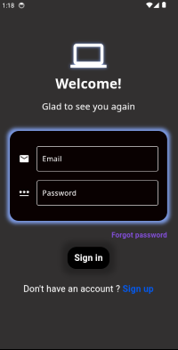
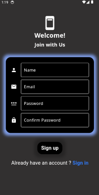
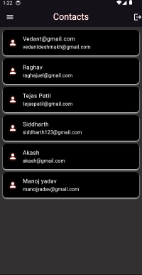
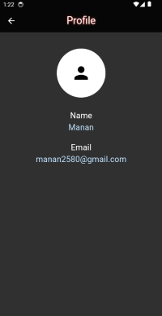

# Minimal Chat App

A basic chat app project.

## Introduction
This is a basic Chat App project made using Flutter framework for frontend, 
Firebase for backend techniques such as Authentication Chatrooms etc. and Cloud Firestore for databases.
This app provides a real time chat experience with mimalistic design and features.

## Installation
### Prerequisites
- Flutter SDK: [Guide](https://flutter.dev/docs/get-started/install)
- Firebase SDK: [Guide](https://firebase.google.com/docs/android/setup)

  ### Steps

1. **Clone the repository:**
    ```sh
    git clone https://github.com/manandev18/minimal-chat-app.git
    cd minimal-chat-app
    ```

2. **Install dependencies:**
    ```sh
    flutter pub get
    ```

3. **Set up Firebase:**
    - Go to the [Firebase Console](https://console.firebase.google.com/).
    - Create a new project.
    - Add an Android app to your Firebase project:
      - Download `google-services.json` and place it in `android/app/`.
    - Add an iOS app to your Firebase project:
      - Download `GoogleService-Info.plist` and place it in `ios/Runner/`.

4. **Run the app:**
    ```sh
    flutter run
    ```

## Usage

1. **Register an account:**
   - Open the app.
   - Click on "Register" and fill in your name, email and password.

2. **Log in:**
   - Enter your registered email and password to log in.

3. **Chat with friends:**
   - Add friends by their email.
   - Start a conversation by selecting a friend and sending a message.
  
## Screenshots

### Login Screen, Register Page, & Forgot Password Page




### Contact page and Chatpage



### Profile Page and Drawer Page



   ## Contributions

 Contributions are welcome! Please follow these steps:

1. Fork the repository
2. Create a new branch (`git checkout -b feature/manandev18`)
3. Commit your changes (`git commit -m 'Add some feature'`)
4. Push to the branch (`git push origin feature/manandev18`)
5. Create a new Pull Request

## LICENSE
This project is licensed under the MIT License. See the [LICENSE](LICENSE) file for details.
